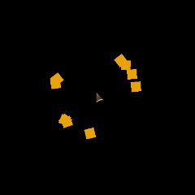
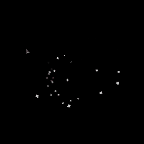

# RenParticles DSL - Руководство пользователя

# Оглавление

* [Введение](#введение)
* [Быстрый старт](#быстрый-старт)
* [Основной синтаксис](#основной-синтаксис)
    * [Объявление системы частиц](#объявление-системы-частиц)
    * [Спрайты частиц](#спрайты-частиц)
    * [Время жизни частиц](#время-жизни-частиц)
    * [Частота обновления](#частота-обновления)
* [Блоки поведения](#блоки-поведения)
    * [on update](#on-update)
    * [on event](#on-event)
    * [on particle dead](#on-particle-dead)
* [Эмиттеры](#эмиттеры)
---
* [Эмиттер: spray](#обработчик-spray)
* [Эмиттер: interval_spray](#обработчик-interval_spray)
* [Эмиттер: mouse_interval](#эмиттер-mouse_interval)
* [Обработчик-Эмиттер: fragmentation (interval_fragmentation_per_particle)](#обработчик-эмиттер-fragmentation-interval_fragmentation_per_particle)
---
* [Поведения частиц](#поведения-частиц-обработчики)
    * [Что это такое?](#что-это-такое)
    * [Идентификаторы обработчиков](#идентификаторы-обработчиков-id)
---
* [Обработчик: auto_expire](#обработчик-auto_expire-или-preset-auto_expire)
* [Обработчик: bounds_killer](#обработчик-bounds_killer-или-preset-bounds_killer)
* [Обработчик: move](#обработчик-move)
* [Обработчик: simple_move](#обработчик-simple_move)
* [Обработчик: friction](#обработчик-friction)
* [Обработчик: bounce](#обработчик-bounce)
* [Обработчик: turbulence](#обработчик-turbulence)
* [Обработчик: face_velocity](#обработчик-face_velocity)
* [Обработчик: flicker](#обработчик-flicker)
* [Обработчик: oscillate](#обработчик-oscillate)
* [Обработчик: orbit_mouse](#обработчик-orbit_mouse-или-preset-orbit_mouse)
* [Обработчик: orbit_point](#обработчик-orbit_point)
* [Обработчик: attractor](#обработчик-attractor)
* [Обработчик: repulsor](#обработчик-repulsor)
* [Обработчик: tween](#обработчик-tween)
* [Обработчик: color_curve](#обработчик-color_curve)
---
* [Пресеты](#пресеты)
    * [Встроенные пресеты](#встроенные-пресеты)
    * [Создание собственных пресетов](#создание-собственных-пресетов)
* [Множественные системы](#множественные-системы)
* [Модели (шаблоны)](#модели-шаблоны)
* [Управление системами](#управление-системами)
    * [Команды управления](#команды-управления)
* [Продвинутые возможности](#продвинутые-возможности)
    * [Пользовательские функции](#пользовательские-функции)
    * [Модификатор oneshot](#модификатор-oneshot)
    * [Динамические свойства](#динамические-свойства)
* [Примеры](#примеры)
    * [Простой дождь](#простой-дождь)
    * [Фейерверк (Пример сложной цепочки)](#фейерверк-пример-сложной-цепочки)
    * [Магический эффект](#магический-эффект)
* [Советы по производительности](#советы-по-производительности)
* [Отладка](#отладка)
* [Ограничения](#ограничения)

## Введение

RenParticles — это система частиц для Ren'Py с собственным DSL (domain-specific language или предметно-ориентированный язык). Вместо написания Python-кода вы описываете поведение частиц декларативно, используя простой синтаксис.

---

## Быстрый старт

```renpy
rparticles as my_particles onlayer master zorder 1:
    sprite expr Solid("#ff0000", xysize=(12, 12))
    lifetime range random (1.0, 3.0)
    redraw asap
    
    preset spray:
        amount 100
    
    preset auto_expire
```

Этот код создаст 100 красных квадратных частиц со случайным временем жизни от 1 до 3 секунд.

---

## Основной синтаксис

### Объявление системы частиц

```renpy
rparticles [model "model_name"] [as tag] [onlayer layer_name] [zorder z] [multiple]:
    # содержимое системы
```

**Параметры:**
- `model "name"` — использовать предопределенную модель
- `as tag` — тег для управления системой (по умолчанию `rparticles_displayable`)
- `onlayer layer_name` — слой отображения (по умолчанию `master`)
- `zorder z` — порядок отрисовки (по умолчанию `0`)
- `multiple` — создать группу из нескольких подсистем

### Спрайты частиц

Определяют внешний вид частиц:

```renpy
sprite image_tag
sprite expr Solid("#ff0000", xysize=(12, 12))
sprite image1; image2; expr Solid("#00ff00", xysize=(8, 8))
```

- Обычный тег изображения: `sprite my_particle_image`
- Python-выражение: `sprite expr <expression>`
- Несколько вариантов через `;` — система выберет случайный

### Время жизни частиц

```renpy
lifetime constant 2.0
lifetime range random (1.0, 3.0)
```

- `constant <число>` — фиксированное время жизни
- `range random (<мин>, <макс>)` — случайное время в диапазоне

### Частота обновления

```renpy
redraw 0.0          # максимальная частота
redraw asap         # то же самое (расш. "as soon as possible" или же "как можно быстрее")
redraw 0.016        # ~60 FPS
redraw None         # обновление по умолчанию
```

Меньшее значение = более плавная анимация, но выше нагрузка.

---

## Блоки поведения

### on update

Выполняется каждый такт для каждой частицы (под тактом подразумевается вызов renpy.redraw, скорость вызова которого вы указываете сами):

```renpy
on update:
    move:
        velocity [0.0, 100.0]
        acceleration [0.0, 50.0]
    
    auto_expire
```

### on event

Реагирует на события мыши:

```renpy
on event:
    repulsor_event
```

### on particle dead

Выполняется когда частица умирает:

```renpy
on particle dead:
    emitter spray:
        amount 3
```

## Эмиттеры

Эмиттеры создают новые частицы.

### Эмиттер: `spray`

Создает частицы единовременно:

```renpy
emitter spray oneshot:
    amount 100
    area (0, 0, 1920, 1080)
```

**Параметры:**
- `amount` — количество частиц (обязательно)
- `area` — область генерации `(x1, y1, width, height)` (по умолчанию весь экран)

### Эмиттер: `interval_spray`

Создает частицы с интервалом:

```renpy
emitter interval_spray:
    amount 500
    interval 0.05
    per_amount 10
```

**Параметры:**
- `amount` — общее количество частиц
* * Может быть задан как `"infinite"`. Тогда частицы будут выпускаться бесконечно.
- `interval` — интервал между генерациями (секунды)
- `per_amount` — частиц за раз (по умолчанию 1)
- `kill_on_finish` — удалить эмиттер после завершения (принимает True (истина) or False (ложь)). По умолчанию – True

---

Отличный эмиттер! Он идеально подходит для создания «курсорных хвостов», магических следов за мышкой или эффектов рисования.

Ниже приведены разделы для обоих руководств.

---

### Эмиттер: `mouse_interval`

Создает частицы в текущей позиции курсора мыши через определенные интервалы времени.

**Пример использования:**

```renpy
rparticles as cursor_trail:
    emitter mouse_interval:
        interval 0.05    # Спавн каждые 50мс
        per_amount 2     # По 2 частицы за раз
        offset (5, 5)    # Небольшое смещение от острия курсора
```

**Параметры:**

* **`amount`** (целое число или "infinite") — Общее количество частиц, которое может создать этот эмиттер. По умолчанию `"infinite"`.
* **`interval`** (число) — Время в секундах между спавнами. По умолчанию `0.1`.
* **`per_amount`** (целое) — Количество частиц, создаваемых за один тик интервала. По умолчанию `1`.
* **`offset`** (два числа) — Смещение точки спавна относительно курсора `(x, y)`. По умолчанию `(0, 0)`.
* **`kill_on_finish`** (логическое значение) — Если `True`, эмиттер удалится из системы после того, как создаст количество частиц, указанное в `amount`. По умолчанию `False`.

---

## Обработчик-Эмиттер: `fragmentation (interval_fragmentation_per_particle)`

Этот обработчик позволяет одной системе (донору) создавать частицы в другой системе (ресивере). Он используется для создания следов (trails), каскадных взрывов или сложных погодных эффектов.

### Синтаксис:

```renpy
# В блоке поведения (on update)
interval_fragmentation_per_particle system "id_системы":
    amount 1      # Количество создаваемых частиц за один такт
    interval 0.1  # Частота создания (в секундах)

```

### Параметры:

* **`system "id"`** (строка): Уникальный идентификатор целевой системы, в которой будут рождаться новые частицы. Небязательный параметр.
>Если задать недействительный `id`, то система будет создавать частицы в текущей системе.
* **`amount`** (целое число): Сколько частиц будет создано за раз при срабатывании интервала.
* **`interval`** (целое или вещественное число): Задержка между циклами генерации.
* **`fallback_position`** (2 числа): Позиция создания частиц, если эмиттер задан через ключевое слово `emitter`.

### Нюансы работы и архитектура

#### 1. Контекстная зависимость (`_has_particle`)

Обработчик автоматически определяет свою роль при первом запуске:

* **Если вызван внутри `on update` частицы без ключевого слова `emitter`**: Он становится «локальным». Каждая родительская частица получает свой собственный таймер. Это позволяет создавать уникальные следы, которые следуют за каждой частицей индивидуально.
* **Если вызван с ключевым словом `emitter`**: Он работает как обычный интервальный эмиттер, создавая частицы в координатах $(0, 0)$ целевой системы.

#### 2. Механика «Следа» (Trails)

Когда частица-родитель движется, она передает свои текущие координаты `x` и `y` создаваемым частицам в целевой системе.

> **Важно:** Созданные частицы «отрываются» от родителя. Они появляются в его позиции, но дальше живут по правилам своей собственной системы (у них может быть своя скорость, гравитация и время жизни).

#### 3. Изоляция таймеров

Благодаря использованию `particles_properties` и уникальных счетчиков (`_RENP_INT_REM_EM`), таймеры разных фрагментаторов не конфликтуют. Если у частицы есть два разных следа (например, дым и искры), они будут генерироваться независимо друг от друга.

#### 4. Работа в одной системе

Если не указывать `system "id"` или указать недействительный `id`, то эмиттер будет работать в текущей системе (там, где его определили).

### Примеры использования

#### Создание «ракеты» с дымным следом:

В этом примере система `rocket` летит вверх и каждые 0.05 секунд оставляет после себя частицу в системе `smoke_trail`.

```renpy
rparticles define multiple "projectile":
    system id "smoke_trail":
        # ... настройки дыма (плавное исчезновение, подъем вверх) ...
        preset auto_expire
        
    system id "rocket":
        # ... настройки самой ракеты ...
        on update:
            move:
                velocity [0, -500]
            
            # Генерация следа
            interval_fragmentation_per_particle system "smoke_trail":
                amount 1
                interval 0.05

```

### Технические особенности

* **UpdateState.Pass**: Обработчик всегда возвращает `Pass`, так как он не изменяет состояние текущей частицы, а лишь инициирует побочный эффект в другой системе.
* **Производительность**: Использование очень малых интервалов (менее 0.02) при большом количестве родительских частиц может привести к экспоненциальному росту количества объектов в памяти. Рекомендуется комбинировать фрагментацию с `preset auto_expire` в целевой системе.
* **Копирование координат**: Новые частицы получают значения `sprite.x` и `sprite.y` в момент создания. Если целевая система имеет смещение (offset), оно будет применено поверх этих координат.

---

## Поведения частиц (обработчики)

### Что это такое?

**Обработчики (behaviors)** — это кирпичики логики, из которых строятся эффекты частиц.

Они работают как **команды для каждой частицы**:
- `move` — задаёт физику движения
- `rotate` — вращает спрайт
- `attractor` — притягивает к точке
- `friction` — замедляет движение
- `tween` — плавно меняет свойства
- и т.д.

```renpy
on update:
    move:                 # обработчик движения
        velocity [100, 0]
    
    rotate:               # обработчик вращения
        speed 360
    
    attractor:            # обработчик притяжения
        target mouse
        strength 500
```

### Идентификаторы обработчиков (id)

Каждому обработчику можно присвоить уникальный идентификатор с помощью ключевого слова `id` на той же строке:

```renpy
on update:
    move id "player_movement":
        velocity [100, 0]
        acceleration [0, 200]
    
    friction:
        target_behavior_id "player_movement"
        friction 0.3
    
    rotate id "spin":
        speed 360
        phase_range 360
```

**Зачем это нужно:**

1. **Взаимодействие между обработчиками**: Один обработчик может ссылаться на другой через `target_behavior_id`. Например, `friction` замедляет конкретное движение, а не все сразу.

2. **Отладка и управление**: Можно легко идентифицировать конкретное поведение в системе.

4. **Расширяемость**: Позволяет создавать сложные цепочки взаимодействий между независимыми поведениями.

**Как это работает:**
- ID должен быть уникальным в пределах одной системы частиц
- Задаётся сразу после имени обработчика, до блока параметров
- Чувствителен к регистру
- Может содержать буквы, цифры и символ подчёркивания

**Пример с несколькими ID:**

```renpy
on update:
    simple_move id "bullet_motion":
        velocity [500, 0]
    
    attractor id "gravity_well":
        target (960, 540)
        strength 3000
    
    friction id "air_resistance":
        target_behavior_id "bullet_motion" # Ссылается на обработчик simple_move
        friction 0.1
    
    rotate id "tumble":
        speed 720
        phase_range 360
```

> **Примечание:** Система ID особенно полезна при комбинировании с поведениями, которые модифицируют друг друга (например, `friction`, `bounce` с привязкой к конкретному движению).

---

### Обработчик: auto_expire или preset: auto_expire

Автоматически уменьшает время жизни и удаляет частицы:

**Пример использования:**

```renpy
on update:
    auto_expire
```
или
```renpy
preset auto_expire
```

---

### Обработчик: bounds_killer или preset: bounds_killer

Обработчик для принудительного уничтожения частиц, вышедших за пределы видимой области экрана или заданных границ. В отличие от `auto_expire`, который работает по времени, этот обработчик работает по координатам.

**Пример использования:**

```renpy
on update:
    bounds_killer:
        margin 50
        only_if_completely True
```
или
```renpy
preset bounds_killer:
    margin 50
    only_if_completely True
```

**Параметры:**

* **`margin`** (число, список или кортеж) — "запас" за пределами экрана в пикселях. По умолчанию `32`.
    * `margin 100` — частица умрет, если выйдет за пределы экрана более чем на 100 пикселей со всех сторон.
    * `margin (100, 200)` — горизонтальный отступ 100, вертикальный 200.
    * `margin (50, 100, 50, 150)` — индивидуальные отступы (Лево, Верх, Право, Низ).


* **`only_if_completely`** (bool) — режим проверки границ.
* `False` (по умолчанию) — частица уничтожается, как только её **центр** (точка координат) пересекает границу.
* `True` — частица уничтожается только тогда, когда она **полностью** скрылась за границей (учитывается размер спрайта). Рекомендуется для крупных объектов, чтобы избежать резкого исчезновения.


* **`safe_zone`** (float) — внутренняя "безопасная зона" от краев экрана. Если частица находится внутри этой зоны, проверки на выход за границы игнорируются. Это полезно для оптимизации логики в очень сложных системах.

> **Совет по производительности**: Всегда используйте `bounds_killer` в системах с бесконечным временем жизни или быстрым движением (`move`), чтобы предотвратить "раздувание" количества невидимых частиц, которые со временем могут замедлить игру.

---

## Обработчик: `move`

Обработчик `move` отвечает за физическое перемещение частиц в пространстве системы. Он реализует классическую модель движения, где на каждом шаге скорость частицы меняет её положение, а ускорение — саму скорость.

### Параметры блока `move`:

* **`velocity`** `[x, y]` (2 вещественных или целочисленных числа): Начальная скорость частицы в пикселях в секунду.
* **`velocity_range`** `[x, y]` (2 вещественных или целочисленных числа): Радиус случайного разброса для начальной скорости. Финальное значение вычисляется как `velocity ± random(velocity_range)`.
* **`acceleration`** `[x, y]` (2 вещественных или целочисленных числа): Постоянное ускорение (например, гравитация).
* **`acceleration_range`** `[x, y]` (2 вещественных или целочисленных числа): Радиус случайного разброса для ускорения. Позволяет сделать так, чтобы частицы в одном потоке падали или взлетали с разной интенсивностью.

### Примеры использования

#### 1. Эффект фонтана (Гравитация)

Частицы вылетают вверх с разбросом и со временем начинают падать вниз под действием ускорения.

```renpy
on update:
    move:
        velocity [0.0, -400.0]        # Резко вверх
        velocity_range [100.0, 50.0]  # Небольшой разброс по сторонам
        acceleration [0.0, 800.0]     # Сильная гравитация вниз

```

#### 2. Ветер или снос

Частицы медленно плывут в сторону, постепенно ускоряясь.

```renpy
on update:
    move:
        velocity [50.0, 0.0]
        acceleration [20.0, 5.0]     # Легкий импульс вправо и вниз
        acceleration_range [5.0, 2.0] # Неоднородность потока

```

### Технические особенности реализации

1. **Двойной проход**: Обработчик обновляет состояние в два этапа:
* Сначала меняются координаты `x` и `y` на основе текущей скорости.
* Затем сама скорость обновляется на основе ускорения.
Это обеспечивает корректное параболическое движение.


2. **Перманентность состояния**: В отличие от чисто визуальных трансформаций, значения `velocity` и `acceleration` вычисляются один раз при инициализации частицы и сохраняются в `particles_properties`. Это гарантирует, что «физический профиль» частицы не изменится до конца её жизни.
3. **Независимость осей**: Расчеты по осям X и Y полностью разделены, что позволяет имитировать сложные силы, например, сильное боковое сопротивление при слабом вертикальном падении.
4. **Delta-time Scaling**: Все расчеты умножаются на `delta` (время прошедшее с последнего кадра), что делает движение плавным и независимым от частоты кадров.

### Важное примечание по координатам:

Обработчик `move` напрямую изменяет свойства `particle.x` и `particle.y`. Эти координаты определяют положение **центра** частицы (благодаря автоматическому смещению `size/2` в системе отрисовки).

---

## Обработчик: `simple_move`

Обработчик `simple_move` реализует равномерное прямолинейное движение. Скорость частицы задаётся один раз при её рождении и остаётся неизменной на протяжении всей её жизни.

### Параметры блока `simple_move`:

* **`velocity`** `[x, y]` (2 вещественных или целочисленных числа): Вектор скорости (пиксели в секунду).
* **`velocity_range`** `[x, y]` (2 вещественных или целочисленных числа): Диапазон случайного отклонения скорости по осям. Финальная скорость частицы рассчитывается как `velocity ± random(velocity_range)`.

---

**Примеры использования:**

#### 1. Прямой поток (Лазер или пули)

Все частицы летят с одинаковой скоростью в одном направлении.

```renpy
on update:
    simple_move:
        velocity [1000.0, 0.0]  # Быстрый полет вправо

```

#### 2. Рассеянный взрыв (без гравитации)

Частицы разлетаются из центра во все стороны и продолжают движение по инерции.

```renpy
on update:
    simple_move:
        velocity [0.0, 0.0]
        velocity_range [300.0, 300.0] # Разлет в случайном направлении

```

### Технические особенности реализации

1. **Линейная инерция**: В отличие от основного обработчика `move`, здесь отсутствует вектор ускорения (`acceleration`). Скорость (`velocity`) вычисляется методом `_get_velocity()` только один раз.
2. **Оптимизация производительности**: Поскольку скорость константна, движку не нужно выполнять операции сложения для изменения вектора скорости в каждом кадре. Это делает `simple_move` идеальным выбором для систем с очень большим количеством частиц (например, плотный снег или дождь без ветра).
3. **Сохранение состояния**: Вектор скорости сохраняется в `particles_properties` под уникальным ключом `_renp_simple_vel_<id>`. Это гарантирует, что даже если в системе произойдёт `freeze` или пауза, после возобновления частица продолжит движение по той же траектории.
4. **Delta-time**: Позиция обновляется с учётом времени кадра (`delta`), что обеспечивает одинаковую скорость движения как при 30 FPS, так и при 144 FPS.

### Сравнение с `move`:

| Особенность | move | simple_move |
| --- | --- | --- |
| **Ускорение** | Поддерживается | Нет |
| **Траектория** | Параболическая (кривая) | Прямая |
| **Нагрузка** | Средняя | Низкая |
| **Применение** | Гравитация, физика, дым | Осадки, пули, простые фоны |

---

## Обработчик: `friction`

Симулирует силу трения (сопротивление среды), постепенно замедляя частицу. Этот обработчик не двигает частицу сам, а напрямую изменяет вектор скорости другого поведения (например, `move` или `simple_move`).

**Параметры:**

* **`target_behavior_id`** (строка, **обязательный**) — Идентификатор (`id`) поведения, чью скорость нужно замедлять.
> Обработчик по `id` должен иметь метод `.get_key()`. Системные обработчики `move` и `simple_move` по-умолчанию имеют данный метод. Если такого метода нет, то `friction` не будет ничего делать.
* **`friction`** (число) — Сила трения. Чем выше значение, тем быстрее частица остановится. По умолчанию `0.1`.
* **`per_axis`** (логическое значение) — Если `True`, трение применяется к каждой оси отдельно. Если `False`, замедляется общий вектор скорости. По умолчанию `True`.
* **`min_speed`** (число) — Порог скорости, ниже которого частица считается полностью остановившейся. По умолчанию `0.01`.

**Пример использования:**

```renpy
on update:
    # Определяем движение и даем ему ID
    move id "main_movement":
        velocity [500, 0]
    
    # Замедляем это движение
    friction:
        target_behavior_id "main_movement"
        friction 2.0
```

---

## Обработчик: `bounce`

Добавляет частицам возможность отскакивать от границ экрана или заданных областей. Для работы требует наличия поведения, отвечающего за движение (например, `move`).

**Параметры:**

* **`target_behavior_id`** (строка, **обязательный**) — ID поведения движения, скорость которого будет инвертирована при ударе.
* **`restitution`** (число) — Коэффициент упругости (от `0.0` до `1.0`).
* * `1.0`: идеальный отскок без потери скорости.
* * `0.0`: частица "прилипает" к границе.
* **`margin`** (число/несколько чисел в скобках) — Отступы от границ экрана.
* * Одиночное число: одинаковый отступ со всех сторон.
* * Список `[left, top, right, bottom]`: индивидуальные отступы.
* **`bounce_axes`** (строка) — Оси отскока: `"both"`, `"x"` или `"y"`.

**Пример использования:**

```renpy
on update:
    move id "ball_physics":
        velocity [300, 300]
    
    bounce:
        target_behavior_id "ball_physics"
        restitution 0.7  # Теряет 30% скорости при ударе
        margin 50        # Отскок в 50 пикселях от края экрана
```

---

## Обработчик: `turbulence`

Добавляет частицам органичное хаотичное движение, имитирующее воздействие ветра, завихрений воздуха или броуновское движение.

В отличие от простых синусоид, этот обработчик использует **LUT (Lookup Table)** с предвычисленным сглаженным шумом. Каждая частица получает случайную точку входа в таблицу, что создает уникальный паттерн движения для каждой единицы в рое.

**Параметры:**

* **`amount`** (2 числа) — Максимальная амплитуда смещения по осям `[x, y]`. По умолчанию `[20.0, 20.0]`.
* **`frequency`** (число) — Частота (скорость) прохождения по таблице шума. Чем выше, тем быстрее частица меняет направление. По умолчанию `1.0`.
* **`smoothness`** (число) — Коэффициент сглаживания от `0.0` до `1.0`.
* `0.0` — мгновенная смена вектора (резкое дрожание).
* `0.5` — сбалансированное движение.
* `0.9+` — очень инертное, плавное парение.

**Пример использования:**

```renpy
on update:
    # Имитация дыма
    simple_move:
        velocity (0, -150)
    
    turbulence:
        amount (40, 20)
        frequency 1.5
        smoothness 0.6

```

---

## Обработчик: `rotate`

Обработчик `rotate` управляет вращением спрайтов частиц. Он позволяет задавать как начальный угол поворота (фазу), так и постоянную скорость вращения с возможностью рандомизации для каждой отдельной частицы.

### Параметры блока `rotate`:

* **`speed`** (целое или вещественное число): Базовая скорость вращения в градусах в секунду. По умолчанию `360.0`.
* **`speed_range`** (целое или вещественное число): Диапазон случайного отклонения скорости. Итоговая скорость будет в пределах `[speed - speed_range, speed + speed_range]`.
* **`phase`** (целое или вещественное число): Базовый начальный угол поворота в градусах.
* **`phase_range`** (целое или вещественное число): Диапазон случайного отклонения начального угла. Итоговая фаза будет в пределах `[phase - phase_range, phase + phase_range]`.

**Примеры использования:**

#### 1. Хаотичное вращение (Искры/Осколки)

Каждая частица получает случайную начальную ориентацию и уникальную скорость вращения.

```renpy
on update:
    rotate:
        speed 180.0       # Базовая скорость
        speed_range 360.0 # Скорость от -180 до +540 град/сек
        phase_range 360.0 # Случайный начальный поворот (0-360)

```

#### 2. Равномерное медленное вращение (Снежинки/Листья)

Частицы медленно вращаются в одну сторону с небольшим разбросом скоростей.

```renpy
on update:
    rotate:
        speed 45.0
        speed_range 15.0  # Скорость от 30 до 60 град/сек
        phase_range 90.0

```

### Технические особенности реализации

1. **Центрирование**: Вращение происходит вокруг геометрического центра спрайта (благодаря автоматическому смещению `size/2` в движке), что исключает вращение вокруг угла.
2. **Накопительный эффект**: В отличие от `tween`, который задает абсолютные значения, `rotate` накапливает угол поворота (`total_rotation`) каждый кадр на основе `delta`. Это позволяет частицам вращаться бесконечно долго без рывков.
3. **Изоляция данных**: Параметры `speed` и `phase` вычисляются один раз при инициализации частицы в `_get_initial_data` и сохраняются в `particles_properties`. Это гарантирует, что скорость вращения частицы не изменится в течение всей её жизни.
4. **Queue Transform**: Использует `particle.queue_transform(rotate=...)`, что позволяет комбинировать вращение с другими трансформациями (например, `zoom` или `alpha` из блоков `tween`) без их взаимного перезаписывания.
> **Важное примечание:** Метод `.queue_transform(...)` **не является** аддитивным или мультипликативным. Он просто записывает значение в очередь на применение. Если два разных обработчика (например, два разных блока `rotate` или `tween`) попытаются изменить одно и то же свойство в одном цикле `update`, **последний** вызвавший метод перезапишет значение предыдущего.

---

### Подсказка для разработчика:

Использование `phase_range 360.0` — это самый простой и эффективный способ избавиться от визуальной повторяемости (паттернов) в системе частиц, так как даже одинаковые спрайты будут выглядеть по-разному под случайными углами.

---

## Обработчик: `face_velocity`

Автоматически поворачивает спрайт частицы так, чтобы он всегда был направлен в сторону её движения.

| Пример |
| :---: |
|  |

**Параметры:**

* **`target_behavior_id`** (строка, **обязательный**) — ID поведения, за чьей скоростью мы следим (например, `move`).
* **`base_angle`** (число) — Дополнительный поворот спрайта в градусах. Если спрайт "смотрит" не туда, используйте это значение для коррекции.
* **`invert`** (логическое значение) — Развернуть частицу в обратную сторону от направления полета.
* **`mode`** (строка) — `"absolute"` (заменяет вращение) или `"additive"` (добавляет к существующему).

**Пример:**

```renpy
on update:
    simple_move:
        id "spark_move"
        velocity (500, 200)
    
    face_velocity:
        target_behavior_id "spark_move"
        base_angle 90.0  # Если исходный спрайт направлен вверх

```

---

## Обработчик: `flicker`

Добавляет случайное «дрожание» значению свойства каждый кадр. Работает аддитивно, то есть прибавляется к уже существующим трансформациям (например, к анимации прозрачности).

### Параметры блока `flicker`:

* **`property`** (строка) — Имя свойства (`"alpha"`, `"zoom"`, `"rotate"`).
* **`base_value`** (число) – Если свойство никак не изменяется другими блоками, то берётся это значение как исходное и на него накладывается «дрожание».
* **`range`** (2 числа) — Диапазон случайных значений `(min, max)`.
* **`interval`** (число) — Пауза между сменой значения мерцания (в секундах). 0.0 — обновление каждый кадр.
* **`mode`** (строка) — Режим наложения:
* * `"add"` — Значение всегда прибавляется (делает свойство больше/ярче).
* * `"sub"` — Значение всегда вычитается (делает свойство меньше/тусклее).

**Пример использования:**

```renpy
on update:
    flicker:
        property "alpha"
        range (-0.2, 0.1)  # Альфа будет случайно скакать в этом диапазоне
```

---

## Обработчик: `oscillate`

Обработчик `oscillate` добавляет к текущим координатам частицы колебательную составляющую на основе функции синуса. Это движение накладывается поверх любых других перемещений (например, `move` или `simple_move`).

### Параметры блока `oscillate`:

* **`amplitudes`** `[x, y]` (2 вещественных или целочисленных числа): Максимальное отклонение от центральной точки по осям X и Y.
* **`frequencies`** `[x, y]` (2 вещественных или целочисленных числа): Количество полных колебаний в секунду.
* **`phases`** `[x, y]` (2 вещественных или целочисленных числа): Начальный сдвиг фазы (в радианах). Позволяет частицам в одной системе колебаться несинхронно.
* **`amplitudes_range` / `frequencies_range` / `phases_range`**: Случайные отклонения соответствующих параметров, вычисляемые индивидуально для каждой частицы при её создании.

**Примеры использования:**

#### 1. Эффект «плавающих» светлячков

Медленные, хаотичные колебания по обеим осям.

```renpy
on update:
    oscillate:
        amplitudes [30.0, 30.0]
        amplitudes_range [10.0, 10.0]
        frequencies [0.5, 0.5]
        phases_range [6.28, 6.28] # Рандомная начальная фаза (0 - 2pi)

```

#### 2. Падающий лист (Зигзаг)

Комбинация с `simple_move`. Лист падает вниз, покачиваясь из стороны в сторону по горизонтали.

```renpy
on update:
    simple_move:
        velocity [0.0, 100.0]
    oscillate:
        amplitudes [50.0, 0.0]  # Колебания только по X
        frequencies [1.5, 0.0]

```

### Технические особенности и нюансы

1. **Аддитивность**: Обработчик является **аддитивным**. Это значит, что он не устанавливает координату частицы, а прибавляет вычисленное смещение к текущему значению `particle.x` и `particle.y`. Это позволяет использовать несколько блоков `oscillate` или совместную обработку с блоками `move` или `simple_move` одновременно для создания сложных фигур Лиссажу.
2. **Накопление ошибки (Drift)**: Поскольку смещение вычисляется на основе `delta` и прибавляется каждый кадр, со временем может накапливаться математическая погрешность (ошибка плавающей точки).
* *Что это значит:* При очень длительном времени жизни частицы её "центр колебаний" может незначительно сместиться относительно первоначальной траектории. Для кратковременных эффектов это незаметно.


3. **Независимость параметров**: Каждая ось (X и Y) имеет собственный таймер и набор настроек, что позволяет создавать круговые или эллиптические движения, если задать одинаковые частоты, но разные фазы.
4. **Производительность**: Использует функцию `math.sin`, что несколько тяжелее простого `move`, но благодаря хранению предвычисленных параметров в `particle_data`, обсчет остается эффективным даже для сотен частиц.

### Математическая справка:

Смещение в каждом кадре рассчитывается по формуле:

$$\Delta = A \cdot \sin(2\pi \cdot f \cdot t + \phi) \cdot dt$$

Где $A$ — амплитуда, $f$ — частота, $t$ — накопленное время жизни, $\phi$ — фаза, а $dt$ — время кадра (`delta`).

---

## Обработчик: orbit_mouse или preset orbit_mouse

Поведение `orbit_mouse` заставляет частицы стремиться к круговой орбите вокруг текущей позиции мыши и вращаться по ней. Благодаря параметру `pull_strength`, частицы могут мягко подлетать к курсору из любой точки экрана, создавая эффект органического притяжения.



### Параметры блока `orbit_mouse`:

* **`radius`** (целое или вещественное число): Желаемый радиус орбиты в пикселях. По умолчанию `100.0`.
* **`speed`** (целое или вещественное число): Базовая угловая скорость вращения. По умолчанию `10.0`.
* **`speed_variance`** (целое или вещественное число): Разброс скорости для каждой частицы (коэффициент 0.0–1.0). Позволяет частицам в рое двигаться с разным темпом. По умолчанию `0.5`.
* **`pull_strength`** (целое или вещественное число): Сила притяжения к идеальной точке на орбите (0.0–1.0). Чем выше значение, тем жестче частица «прикована» к радиусу. По умолчанию `0.5`.
* **`clockwise`** (логическое значение): Направление вращения. `True` — по часовой стрелке, `False` — против.
* **`screen_bounds`** (логическое значение): Если `True`, частицы не смогут вылететь за границы игрового окна (удерживаются в пределах 2 пикселей от края). По умолчанию `True`.

### Примеры использования

#### 1. Плотное магическое кольцо вокруг курсора

Частицы быстро и жестко следуют за мышью.

```renpy
on update:
    orbit_mouse:
        radius 80.0
        speed 15.0
        pull_strength 0.8
        speed_variance 0.2

```

#### 2. Ленивый рой «светлячков»

Мягкое притяжение и большой разброс скоростей создают эффект живого облака.

```renpy
on update:
    orbit_mouse:
        radius 200.0
        speed 3.0
        pull_strength 0.1
        speed_variance 0.8
        clockwise False

```

### Технические особенности реализации

1. **Динамический захват**: Если расстояние до мыши становится критически малым (< 1 пикселя), обработчик автоматически «выбрасывает» частицу на заданный радиус под случайным углом, чтобы избежать деления на ноль в расчетах и визуального "слипания".
2. **Векторная математика**:
* Алгоритм вычисляет нормализованный вектор от мыши к частице (`nx`, `ny`).
* На основе направления (`clockwise`) создается перпендикулярный вектор для вращения.
* Финальная позиция частицы — это интерполяция между её текущим местоположением и целевой точкой на орбите, умноженная на `pull_strength`.


3. **Индивидуальность**: Скорость каждой частицы вычисляется один раз при инициализации с учетом `speed_variance` и сохраняется в `_orbit_speed`. Это предотвращает «марширование строем» и делает рой хаотичным и живым.
4. **Безопасность (Screen Bounds)**: Встроенная проверка границ гарантирует, что даже при резком рывке мыши частицы не «улетят в бесконечность», что критично для интерактивных меню.

### Нюанс для разработчика:

Этот обработчик лучше всего работает как **единственный** контроллер позиции. Если вы добавите `move` или `oscillate` в тот же блок `on update`, частицы могут начать вести себя непредсказуемо (дрожать или улетать по спирали), так как `orbit_mouse` постоянно перезаписывает координаты `particle.x/y`, пытаясь вернуть их на орбиту. Хотя никто не запрещает экспериментировать :).

---

## Обработчик: `orbit_point`

Аналогичен по принципу действия `orbit_mouse`, но работает вокруг статичной точки на экране. Частицы стремятся к заданному радиусу и вращаются вокруг центра.

**Параметры:**

* **`center`** (2 числа, **обязательный**) — Координаты точки центра орбиты `(x, y)`.
* **`radius`** (число) — Целевой радиус орбиты в пикселях. По умолчанию `100.0`.
* **`speed`** (число) — Базовая скорость вращения. По умолчанию `10.0`.
* **`speed_variance`** (число) — Разброс скорости для каждой частицы (от 0.0 до 1.0). По умолчанию `0.5`.
* **`pull_strength`** (число) — Сила «притяжения» к радиусу (от 0.0 до 1.0). Позволяет частицам плавно выходить на орбиту. По умолчанию `0.5`.
* **`clockwise`** (логическое значение) — Направление вращения. `True` — по часовой стрелке. По умолчанию `True`.
* **`screen_bounds`** (логическое значение) — Удерживать ли частицы в пределах экрана. По умолчанию `True`.

**Пример использования:**

```renpy
on update:
    orbit_point:
        center (960, 540) # Центр экрана
        radius 250
        speed 15.0
        pull_strength 0.3 # Частицы будут медленно притягиваться к кругу

```

---

## Обработчик: `repulsor`

*Этот функционал основан на классическом примере из документации Ren'Py, но адаптирован под архитектуру RenParticles с разделением на обновление (update).*

Связка `repulsor_update` и `repulsor_event` создает зону отталкивания. Когда курсор мыши оказывается рядом с частицей, она выталкивается за пределы указанного радиуса.

### Синтаксис:

```renpy
on update:
    repulsor_update:
        strength 5.0     # Сила импульса
        radius 200.0     # Дистанция влияния
        clamp_margin 2.0 # Удержание внутри экрана

on event:
    repulsor_event       # Передает координаты мыши в систему

```

### Параметры:

* **`strength`** (целое или вещественное число): Сила, с которой частица выталкивается от центра. По умолчанию `3.0`.
* **`radius`** (целое или вещественное число): Радиус действия «репульсора». Если частица дальше этого расстояния, эффект не применяется. По умолчанию `150.0`.
* **`clamp_margin`** (целое или вещественное число): Отступ от краев системы, чтобы частицы, выталкиваемые за экран, не исчезали полностью, а «прилипали» к краю. По умолчанию `2.0`.

### Как это работает (Архитектура)

1. **Событийный слой (`repulsor_event`)**: Этот обработчик срабатывает при движении мыши над областью частиц. Он записывает текущие координаты `x, y` в общее хранилище данных системы (`system.particles_data.repulsor_pos`). Это избавляет каждую частицу от необходимости опрашивать движок Ren'Py напрямую.
2. **Слой обновления (`repulsor_update`)**:
* В каждом кадре частица проверяет наличие `repulsor_pos`.
* Вычисляется вектор между частицей и «репульсором».
* **Затухание (Falloff)**: Сила отталкивания не постоянна. Она максимальна в центре и линейно убывает до нуля к границе радиуса. Это создает эффект мягкого выталкивания, а не резкого телепорта.
* **Ограничение (Clamp)**: Если сила выталкивает частицу за пределы области `width/height`, обработчик принудительно возвращает её на границу с учетом `clamp_margin`.

### Примеры использования

#### 1. Интерактивное облако (эффект «раздвигания» тумана)

Частицы медленно парят, но разлетаются, если навести на них мышь.

```renpy
rparticles define preset interactive_fog:
    on update:
        simple_move:
            velocity [10, 0]
        repulsor_update:
            strength 4.0
            radius 180.0
    on event:
        repulsor_event

```

#### 2. Защитный барьер

Если задать очень высокую силу, мышь будет работать как непроницаемый щит для частиц.

```renpy
on update:
    repulsor_update:
        strength 50.0 # Мгновенное выталкивание
        radius 100.0

```

### Нюансы реализации

* **Связка обязательна**: `repulsor_update` сам по себе не знает, где находится мышь. Ему нужны данные, которые поставляет `repulsor_event`.
* **Тип контекста**: В коде предусмотрена строгая проверка: `repulsor_event` может работать только в `on event`, так как ему необходим `EventContext` (содержащий координаты события). Попытка вызвать его в `on update` вызовет понятную ошибку.
* **Аддитивность**: Как и осциллятор, этот обработчик изменяет `p.x/y` напрямую, прибавляя силу к текущей позиции. Это значит, что он отлично сочетается с любыми методами движения (`move`, `simple_move`), работая как «внешняя сила».

### Использование готового пресета:

Существует пресет глобального уровня `repulsor`, который позволяет подключить всё сразу одной строкой.
Пресет является статическим, а значит он знает как распределить переопределяемые параметры:

```renpy
rparticles define system "my_system":
    preset repulsor:
        strength 10.0
        radius 250.0

```

---

## Обработчик: `attractor`

Создает точку притяжения (или отталкивания), которая воздействует на частицы. В отличие от `orbit`, этот обработчик использует физику сил и ускорений, создавая инерционное движение.

| Пример |
| :---: |
|  |

**Параметры:**

* **`target`** ("mouse"/2 числа в скобках, **обязательный**) — Точка притяжения. Либо `"mouse"`, либо кортеж с координатами `(x, y)`.
* **`strength`** (число) — Сила притяжения. Положительные значения притягивают, отрицательные — отталкивают. По умолчанию `500.0`.
* **`radius`** (число) — Радиус действия. `0.0` — действует на весь экран. По умолчанию `0.0`.
* **`falloff`** (число) — Степень затухания силы с расстоянием:
* * `0.0`: Сила постоянна везде.
* * `1.0`: Линейное затухание (гравитация).
* * `2.0+`: Экспоненциальное затухание (магнетизм).


* **`max_speed`** (число) — Ограничение скорости частицы, чтобы она не «улетала в космос». По умолчанию `1000.0`.
* **`screen_bounds`** (логическое значение) — Удерживать частицы в границах экрана. По умолчанию `True`.

**Пример использования:**

```renpy
on update:
    # Эффект черной дыры в центре экрана
    attractor:
        target (960, 540)
        strength 2000.0
        radius 600.0
        falloff 0.25 # Сильное приятяжение. Слабая зависимость от расстояния
```

---

## Обработчик: `tween`

Обработчик `tween` предназначен для плавного изменения свойств трансформации спрайта (alpha, zoom, rotate и др.) во времени. Поддерживает как фиксированные временные интервалы, так и динамическую привязку к жизненному циклу частицы.

### Параметры блока `block`:

* **`time`** (целое или вещественное число): Длительность анимации. В режиме `absolute` — секунды, в режиме `lifetime` — коэффициент (0.0–1.0).
* **`start_value`** (целое или вещественное число): Начальное значение свойства.
* **`end_value`** (целое или вещественное число): Конечное значение свойства.
* **`warper`** (строка): Функция интерполяции (названия стандартных [варперов Ren'Py](https://www.renpy.org/doc/html/transforms.html#warpers): `"linear"`, `"ease"`, `"easein_expo"`, `"easin_circ"` и т.д.). По умолчанию `"linear"`.
* **`from_end`** (логическое значение): Если `True`, анимация начнется в конце жизни частицы так, чтобы завершиться ровно в момент её исчезновения.
* **`mode`** (строка): Режим расчета времени:
    - `"absolute"` (по умолчанию): `time` трактуется как фиксированное время в секундах.
    - `"lifetime"`: `time` трактуется как доля от общего времени жизни частицы.
* **`animation_mode`** (строка): Режим проигрывания:
    - `"once"` (по умолчанию): Проигрывается один раз и замирает в конечном значении.
    - `"loop"`: После завершения мгновенно прыгает в начало и повторяется.
    - `"ping-pong"`: Доходит до конца, плавно возвращается в начало и так по кругу.

### Примеры использования

#### 1. Базовая анимация (Абсолютное время)

Простое появление и уменьшение спрайта при создании.

```renpy
on update:
    tween:
        block "alpha":
            time 0.5
            start_value 0.0
            end_value 1.0
        block "zoom":
            time 1.0
            start_value 2.0
            end_value 1.0
            warper "ease"

```

#### 2. Адаптивная анимация (Lifetime mode)

Анимация, которая подстраивается под время жизни частицы. Если частица живет 2 секунды, альфа проявится за 0.4с. Если живет 10 секунд — за 2с.

```renpy
on update:
    tween:
        block "alpha":
            mode "lifetime"
            time 0.2  # 20% от времени жизни на проявление
            start_value 0.0
            end_value 1.0

```

#### 3. Анимация исчезновения (from_end)

Например, для плавного затухания частиц перед их удалением. Анимация начнется автоматически, исходя из оставшегося времени жизни.

```renpy
on update:
    # Анимировать альфу до 0.0 в последние 0.5 секунд жизни
    tween:
        block "alpha":
            from_end True
            time 0.5
            start_value 1.0
            end_value 0.0

```

### Технические особенности реализации

1. **Параллельное выполнение свойств**: Внутри одного блока `tween` можно описывать несколько `block` для разных свойств. Они будут выполняться параллельно и независимо.
2. **Уникальность состояний**: Каждая частица хранит свой прогресс анимации в `particles_properties` под уникальным ключом, что исключает конфликты при использовании нескольких `tween` в одной системе.
3. **Оптимизация**: После завершения всех анимаций в блоке, обработчик выставляет флаг `_completed` и перестает производить вычисления в `__call__`, просто пропуская итерации (UpdateState.Pass).
4. **Безопасность**: Все значения на выходе проходят через `_renp_clamp`, предотвращая выход за границы диапазона `[start, end]`, что критично при использовании сложных варперов с "отскоками".

**Доступные свойства:** alpha, zoom, xzoom, yzoom, rotate, xpos, ypos и другие свойства `Transform`.

>**Важное примечание**: Имейте ввиду, что трансформация свойств это достаточно дорогая операция для RenPy, а потому примение `tween` обработчика сильно усложняет жизнь процессору. Однако увеличение блоков `tween` влияет на производительность относительно незначительно, т.к. **RenParticles** использует **отложенную отрисовку** (Lazy Rendering) и `tween` использует этот механизм. Все `tween` блоки всего лишь отправляют новую трансформацию в очередь, а движок в конце кадра все разом их применяет. Подробнее в Developer_Ru.md (раздел *Управление визуализацией*)

---

## Обработчик: `color_curve`

| Пример |
| :---: |
|  |

Позволяет частице менять цвет в течение её жизненного цикла. Идеально подходит для огня (белый -> желтый -> красный -> серый) или магических эффектов.

**Параметры:**

* **`colors`** (список) — Список цветов в формате Ren'Py (строки `"#hex"`, кортежи `(r,g,b)` или объекты `Color`). Должно быть минимум 2 цвета для анимации.
* **`warper`** (строка): Функция интерполяции (названия стандартных [варперов Ren'Py](https://www.renpy.org/doc/html/transforms.html#warpers): `"linear"`, `"ease"`, `"easein_expo"`, `"easin_circ"` и т.д.). По умолчанию `"linear"`.

**Пример (Эффект остывающей искры):**

```renpy
on update:
    move id "move":
        velocity [0, -200]
        velocity_range [250, 75]
        acceleration [0, 600]

    # Имитация "остывания" искры
    color_curve:
        colors ["#ffffff", "#ffcc00", "#ff4400", "#33333300"]
        warper "easein_quad"

    face_velocity:
        target_behavior_id "move"
        base_angle 90

    auto_expire

```

>**Важно**: Вы обязаны задать время жизни частицам. Иначе вы получите ошибку, когда попытаетесь вывести систему частиц на экран.

---

## Пресеты

Пресеты — готовые комбинации поведений.

### Встроенные пресеты

```renpy
preset spray:
    amount 100

preset interval_spray:
    amount 500
    interval 0.05

preset auto_expire

preset repulsor:
    strength 5.0
    radius 200.0

preset orbit_mouse:
    speed 10.0
    pull_strength 0.5
```

### Создание собственных пресетов

```renpy
init 100:
    rparticles define preset my_preset type general:
        on update:
            move:
                velocity [0.0, 100.0]
                acceleration [0.0, 50.0]
            
            tween:
                block "alpha":
                    time 1.0
```

**Типы пресетов:**
- `type general` — используется на верхнем уровне системы.
- `type inner` — используется внутри блоков on update/event/particle dead.

### Технические особенности реализации
1. **Одноуровневость**: Рекурсивные пресеты недоступны.
2. **Диспетчеризация параметров**: Динамические пресеты не знают как передавать переопределяемые параметры (когда вы при использовании пресета в системе открываете блок параметров). Такие параметры никуда не пойдут, хотя и есть возможность их задавать. Имейте это ввиду.

---

## Множественные системы

Создание нескольких независимых систем частиц:

```renpy
rparticles multiple as particles onlayer master:
    redraw asap
    
    system id "fire":
        sprite expr Solid("#ff4400", xysize=(8, 8))
        lifetime constant 1.0
        
        preset interval_spray:
            amount 100
            interval 0.01
        
        on update:
            move:
                velocity [0.0, -100.0]
            auto_expire
    
    system id "sparks":
        sprite expr Solid("#ffff00", xysize=(4, 4))
        lifetime range random (0.5, 1.5)
        
        preset spray:
            amount 50
        
        on update:
            move:
                velocity [0.0, 0.0]
                velocity_range [200.0, 200.0]
            auto_expire
```

Взаимодействие между системами:

```renpy
on update:
    interval_fragmentation_per_particle system "sparks":
        amount 3
        interval 0.2
```

---

## Модели (шаблоны)

Сохранение конфигурации для повторного использования:

```renpy
init:
    rparticles define "explosion_effect":
        sprite expr Solid("#ff0000", xysize=(16, 16))
        lifetime range random (0.5, 1.5)
        redraw asap
        
        preset spray:
            amount 200
        
        on update:
            move:
                velocity [0.0, 0.0]
                velocity_range [300.0, 300.0]
                acceleration [0.0, 500.0]
            
            tween:
                block "alpha":
                    time 1.0
                block "zoom":
                    time 1.0
                    start_value 1.5
                    end_value 0.0
            
            auto_expire

label game:
    # Использование модели
    rparticles model "explosion_effect" as explosion1
```

---

## Управление системами

### Команды управления

```renpy
# Показать систему
rparticles model "my_model" as particles

# Сбросить систему (удалить все частицы, перезапустить эмиттеры и обработчики)
rparticles reset "particles"

# Заморозить систему (остановить обновление)
rparticles freeze "particles"

# Разморозить систему
rparticles unfreeze "particles"
rparticles unfreeze "particles" noredraw

# Управление подсистемами
rparticles freeze "particles"."fire"
rparticles unfreeze "particles"."sparks" noredraw

# Скрыть систему
hide particles

# Показать снова
rparticles continue "particles" onlayer master zorder 1

# Очистить кэш
rparticles clear cache        # удалить скрытые системы
rparticles clear cache deep   # удалить все системы
```

---

## Продвинутые возможности

### Пользовательские функции

Вместо шорткатов можно использовать Python-классы отнаследованные от `_Behavior`, `Emitter`:

```renpy
on update:
    custom my_custom_Behavior oneshot
    custom my_custom_Behavior system "target_system"
```

### Модификатор oneshot

Выполнить поведение один раз:

```renpy
on update:
    emitter spray oneshot:
        amount 100
```

### Динамические свойства

Для сложных конфигураций:

```renpy
tween:
    block "alpha":
        time 0.5
    block "zoom":
        time 1.0
        start_value 2.0
        end_value 0.5
        warper "easein"
```

---

## Примеры

### Простой дождь

```renpy
rparticles as rain onlayer master:
    sprite expr Solid("#4488ff", xysize=(2, 8))
    lifetime constant 3.0
    redraw 0.016
    
    preset interval_spray:
        amount 1000
        interval 0.01
        per_amount 5
    
    on update:
        move:
            velocity [0.0, 500.0]
        auto_expire
```

### Фейерверк (Пример сложной цепочки)

```renpy
rparticles multiple as firework:
    system id "trail":
        sprite expr Solid("#ffffff", xysize=(2, 2))
        lifetime constant 0.5
        on update:
            tween:
                block "alpha": 
                    from_end True
                    time 0.5
                    start_value 1.0
                    end_value 0.0
            auto_expire

    system id "shell":
        sprite expr Solid("#ffff00", xysize=(4, 4))
        lifetime constant 1.5
        on update:
            move:
                velocity [0, -400]
                acceleration [0, 200]
            # Создаем след из системы trail
            interval_fragmentation_per_particle system "trail":
                amount 1
                interval 0.02
            auto_expire
        # Взрыв при смерти "снаряда"
        on particle dead:
             emitter spray oneshot:
                amount 50
                # Здесь можно добавить логику разлета осколков
```

### Магический эффект

```renpy
rparticles as magic onlayer master:
    sprite expr Solid("#aa00ff", xysize=(12, 12))
    lifetime range random (2.0, 4.0)
    redraw asap
    
    preset interval_spray:
        amount 200
        interval 0.02
    
    on update:
        orbit_mouse:
            radius 100.0
            speed 8.0
            pull_strength 0.2
        
        tween:
            block "alpha":
                time 2.0
        
        auto_expire
```

---

## Советы по производительности

1. Используйте `redraw 0.016` вместо `asap` если не нужна максимальная частота
2. Ограничивайте количество одновременных частиц
3. Используйте `lifetime` для автоматического удаления частиц
4. Для статичных эффектов используйте `cache`
5. Группируйте похожие частицы в одну систему

---

## Отладка

Система выводит информацию о конфигурации в консоль при создании. Проверьте консоль Ren'Py для диагностики проблем.

---

## Ограничения

- Спрайты рисуются со смещением `размер_спрайта / 2` от указанной позиции
- Рекурсивные пресеты не поддерживаются
- Максимальная производительность зависит от количества частиц и сложности поведений
